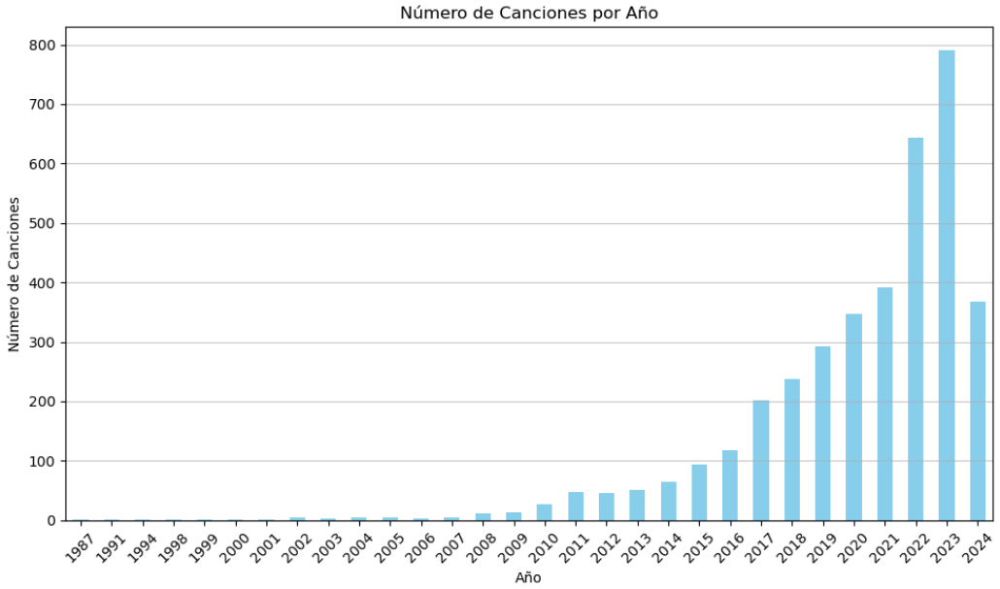
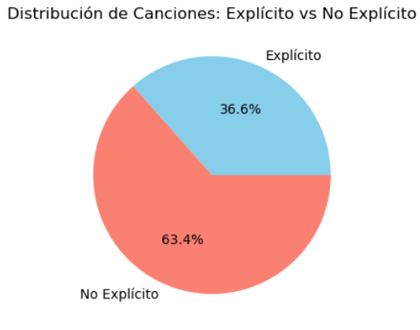
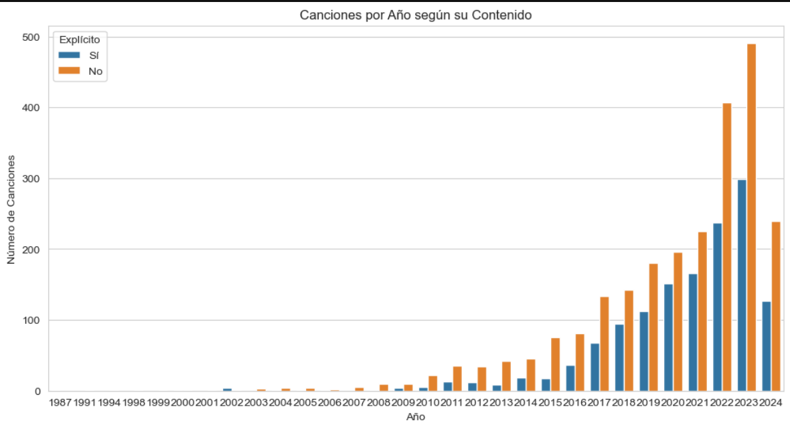

---
title: "Análisis de Datos con Python: Un Breve Ejercicio Práctico"
date: 2024-09-05
draft: false
description: "Análisis de Datos con Python sobre un dataset de canciones de Spotify 2024"
tags: [python, data analysis, dataset, pandas, numpy, matplotlib, seaborn, jupyter]
---

# Análisis de Datos con Python: Un Breve Ejercicio Práctico 


Foto de [Heidi Fin](https://unsplash.com/es/@framesbyfin?utm_content=creditCopyText&utm_medium=referral&utm_source=unsplash) en [Unsplash](https://unsplash.com/es/fotos/ipad-blanco-y-negro-H4fYXZ1hyco?utm_content=creditCopyText&utm_medium=referral&utm_source=unsplash)

Dentro del área de la **ciencia de datos**, la carga o el análisis exploratorio de datos son algunas de las tareas que puedes realizar con un **dataset** o **conjunto de datos**.  Además, dependiendo de la información que necesites obtener, tendrás que realizar otras tareas adicionales.

Antes de comenzar un análisis de datos, es necesario conocer los pasos a seguir. En la siguiente lista puedes ver el orden de su implementación:

1.  Carga de los datos (**dataset**).
    
2.  Análisis Exploratorio de los Datos.
    
3.  Preparación y tratamiento previo de los datos.
    
4.   Visualización gráfica de los datos.
    
5.  Generación del modelo de aprendizaje automático.
    
6.  Entrenamiento del modelo de aprendizaje automático.
    
7.  Definición del modelo predictivo.
    
8.  Evaluación del modelo entrenado con datos reservados.

En el ejercicio, que a continuación explico, solo quiero obtener información de las canciones de **Spotify**. Al tratarse de un breve análisis escrito con **Python**, si deseas ver el ejercicio completo, puedes descargarlo en el repositorio en **Github**. 




## ⚠️ Antes de comenzar 

Antes de comenzar un **análisis de datos**, es muy importante definir la información que necesitas obtener, porque sin un objetivo claro, no tendrás un punto de partida.

# Cargar el dataset

El **dataset** o **conjunto de datos**  (`MostStreamedSpotifySongs2024.csv`) consta de una serie de columnas que hacen referencia a las principales plataformas de música en streaming. En este caso, solo quiero explorar los datos de **Spotify**. La información que quiero conocer es la siguiente: 

* Canciones por año
* Porcentaje de Canciones: Explícito **VS** No Explícito.
* Canciones más escuchadas por año con y sin contenido explícito.
* Canción con más Streams

## Importar las librerías

Las librerías **Pandas**, **Numpy**, **Matplotlib** y **Seaborn**  facilitan mucho el trabajo por la gran cantidad de métodos que ofrecen. 
```
# Manipulación de datos con DataFrames.
import pandas as pd
# Operaciones numéricas y manejo de arrays.
import numpy as np
# Creación de gráficos.
import matplotlib.pyplot as plt
# Visualización estadística avanzada.
import seaborn as sns
# Muestra gráficos en el notebook de Jupyter.
%matplotlib inline
```

## Lectura del archivo

En este ejercicio, solo hay un único archivo en formato **csv** con codificación  ISO-8859-1. Para evitar errores de lectura, es importante especificar la codificación, ya que algunos archivos contienen caracteres especiales. 
```
# Lectura del archivo, la codificación es ISO-8859-1
file_path = ('MostStreamedSpotifySongs2024.csv')
data = pd.read_csv(file_path, encoding='ISO-8859-1')
```

## Visualizar la tabla con los datos

Una vez cargados los datos, hay que visualizar la información que contiene.  
El método **head()** muestra las cinco primeras filas del archivo.
```
# Vemos la tabla con todos los datos 
data.head()
```
## Dimensión del dataset

Conocer las dimensiones del **dataset** ayuda a entender el número de datos con los que se va a trabajar.
```
# Dimesiones del set de datos
print(f'Tamaño del set de datos: {data.shape}')
```

## Observación del dataframe

Antes de comenzar con la limpieza de datos, hay que comprobar si hay datos faltantes. 
```
# Lista de las variables categóricas y numéricas
data.info()
```

### Datos nulos y datos duplicados

Al observar que faltan datos en las columnas, lo siguiente es conocer la cantidad de datos nulos y duplicados. Para obtener el total de ambos, se añade a cada método **sum()**.

```
# Suma de los nulos
data.isnull().sum()
```

```
# Suma de los registros duplicados
data.duplicated().sum()
```

# Limpieza de datos

Los siguientes procesos de limpieza son necesarios para conseguir un **dataset**  **íntegro**.

## Filas duplicadas

El método **drop_duplicates()** es utilizado para eliminar datos duplicados.
```
# Encontrar todos los registros duplicados
duplicated_rows = data[data.duplicated()]
# Mostrar los registros duplicados
print(duplicated_rows)

# Eliminar filas duplicadas
print(f'Tamaño del set antes de eliminar las filas duplicadas: {data.shape}')
data.drop_duplicates(inplace=True) 
print(f'Tamaño del set después de eliminar las filas duplicadas: {data.shape}')
```

## Filas nulas

El primer paso es filtrar las filas donde  _Artist_ es nulo y eliminarlas.
```
# Filtrar las filas donde 'Artist' es nulo
null_artists = data[data['Artist'].isnull()]

# Mostrar los índices de las filas con valores nulos en 'Artist'
print("\nÍndices de los artistas que son nulos:")
print(null_artists.index.tolist())

# Eliminar artistas nulos
print(f"Número de artistas nulos antes de eliminarlos: {data['Artist'].isnull().sum()}")
data.dropna(subset=['Artist'], inplace=True)
print(f"Número de artistas nulos después de eliminarlos: {data['Artist'].isnull().sum()}")
```

# Transformar los datos

Como el objetivo el análisis es explorar únicamente los datos de **Spotify**, las columnas correspondientes a otras plataformas de música son eliminadas.
```
# Eliminar columnas que no son consideradas para el objetivo principal
# Definir la lista de columnas a eliminar
columns_to_drop = [
    'YouTube Views', 'YouTube Likes', 'TikTok Posts', 'TikTok Likes', 'TikTok Views', 
    'YouTube Playlist Reach', 'Apple Music Playlist Count', 'AirPlay Spins', 'SiriusXM Spins', 
    'Deezer Playlist Count', 'Deezer Playlist Reach', 'Amazon Playlist Count', 'Pandora Streams', 
    'Pandora Track Stations', 'Soundcloud Streams', 'Shazam Counts', 'TIDAL Popularity'
]

# Eliminar las columnas
data.drop(columns=columns_to_drop, axis=1, inplace=True)
```

# Visualización de los datos

Después de realizar los procesos de carga, limpieza y transformación de los datos, lo siguiente es visualizar la información que pide el ejercicio.    


## Canción por año
```
# Contar el número de canciones por año
songs_by_year = data['Year'].value_counts().sort_index()

# Crear el gráfico
plt.figure(figsize=(10, 6))
songs_by_year.plot(kind='bar', color='skyblue')
plt.title('Número de Canciones por Año')
plt.xlabel('Año')
plt.ylabel('Número de Canciones')
plt.xticks(rotation=45)
plt.grid(axis='y', linestyle='-', alpha=0.7)

# Mostrar el gráfico
plt.tight_layout()
plt.show()
```




## Porcentaje de Canciones: Explícito vs No Explícito.

```
# Total de canciones con letra explícita
# Contar el número de ocurrencias de 0 y 1
value_counts = data['Explicit Track'].value_counts()

# Mapear los valores binarios a etiquetas explícitas
labels = ['Explícito', 'No Explícito']
sizes = [value_counts.get(1, 0), value_counts.get(0, 0)]

# Crear el gráfico circular
plt.figure(figsize=(4, 8))
plt.pie(sizes, labels=labels, autopct='%1.1f%%', colors=['skyblue', 'salmon'])
plt.title('Distribución de Canciones: Explícito vs No Explícito')

# Mostrar el gráfico
plt.show()
```


## Canciones más escuchadas por año con y sin contenido explícito

```
# Filtrar canciones explícitas y no explícitas
explicit_data = data[data['Explicit Track'] == 1]
no_explicit_data = data[data['Explicit Track'] == 0]

# Agrupar por año con contenido explícito y sin contneido explícito
explicit_track = explicit_data.groupby('Year')['Track'].count().reset_index()
no_explicit_track = no_explicit_data.groupby('Year')['Track'].count().reset_index()

# Renombrar las columnas para unificar el DataFrame
explicit_track.rename(columns={'Track': 'Count'}, inplace=True)
explicit_track['Explícito'] = 'Sí'
no_explicit_track.rename(columns={'Track': 'Count'}, inplace=True)
no_explicit_track['Explícito'] = 'No'

# Unir los dos DataFrames
data_combined = pd.concat([explicit_track, no_explicit_track])

# Crear el gráfico usando Seaborn
plt.figure(figsize=(12, 6))
sns.set_style("whitegrid")

# Crear gráfico de barras
sns.barplot(data=data_combined, x='Year', y='Count', hue='Explícito')

# Añadir título y etiquetas
plt.title('Canciones por Año según su Contenido')
plt.xlabel('Año')
plt.ylabel('Número de Canciones')

# Mostrar el gráfico
plt.show()
```



## Canción con más Streams

```
# Identificar la fila con la canción más escuchada
most_listened_song = data.loc[data['Spotify Streams'].idxmax()]
print(f"La canción más streams es '{most_listened_song['Track']}' de {most_listened_song['Artist']} con {most_listened_song['Spotify Streams']} streams.")
```

# Conclusiones 

Después de explorar y visualizar los datos de las canciones más escuchadas de  **Spotify**  en 2024, he sacado las siguientes reflexiones.

En la gráfica de las  _Canciones por año según su contenido_  se puede observar un aumento del número de canciones con contenido explícito a partir de 2015. La explicación de este incremento puede deberse a los siguientes factores:

- Aumento de nuevos artistas que emplean un uso del lenguaje más explícito.
- Aparición o fusión de nuevos estilos musicales.
- Reflejos de la sociedad en la letra de las canciones con motivos reivindicativos.
- Otros motivos.

Otro resultado que me ha resultado curioso es que la canción con más reproducciones es una de mis favoritas y no es la que tiene la mayor puntuación. Entonces, surge la pregunta: ¿cuál es la clave del éxito en una canción?




Espero que este artículo haya sido de utilidad para ti. 🍀
