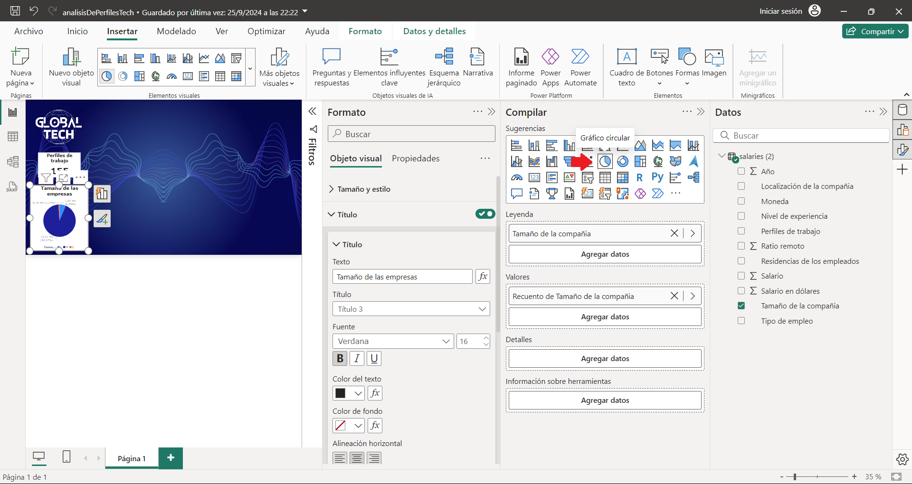
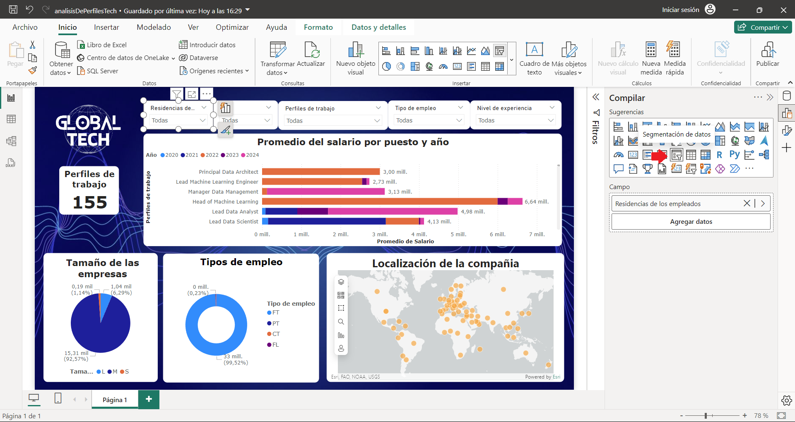

# Informe sobre Salarios y Empleo en Ingeniería de Datos con Power BI (2024)

Foto de [Lukas Blazek](https://unsplash.com/es/@goumbik?utm_content=creditCopyText&utm_medium=referral&utm_source=unsplash) en [Unsplash](https://unsplash.com/es/fotos/computadora-portatil-encendida-en-negro-y-gris-mcSDtbWXUZU?utm_content=creditCopyText&utm_medium=referral&utm_source=unsplash)

## Introducción a la Inteligencia de Negocio

En el área de la **Inteligencia de Negocio** o **Business Intelligence**, la representación gráfica de los datos, ya sea a nivel departamental o global, es clave para comprender la situación actual de la empresa. Esto permite definir estrategias para facilitar los principales objetivos de la organización.

En la actualidad, hay empresas de **software** que ofrecen plataformas y herramientas para la visualización de datos, como **Power BI** o **Tableau**. Para este _breve_ proyecto, que explicaré más adelante, lo he realizado utilizando **Power BI** de **Microsoft**.

## Conceptos del Análisis de Datos

Antes de comenzar con la explicación, me gustaría que conozcas los siguientes conceptos, ya que te ayudarán a comprender su significado en el contexto de la visualización de datos. Son los siguientes:

- Informe.
- Cuadro de mando.
- Métricas o KPIs.
- Técnicas de visualización.

#### Informe
Es la representación visual de los datos de la empresa en un momento determinado. Incluye gráficas y tablas que muestran la información necesaria para realizar el análisis posterior.

#### Cuadro de mando
Es la representación de forma dinámica en tiempo real de los datos de la empresa. Facilita al usuario el seguimiento de las principales métricas o KPIs.

#### Métricas o KPIs
Son métricas que permiten evaluar el rendimiento de un área específica dentro de una estrategia empresarial. Estas métricas pueden ayudar a identificar las áreas que no están funcionando como se esperaba.

#### Técnicas de visualización
Es la representación visual de los datos como gráficos de barras, mapas de calor o diagramas de dispersión. Muestran los datos de forma clara y concisa.

En la siguiente lista puedes ver las técnicas de visualización:
- Gráfico de puntos.
- Gráfico de líneas.
- Gráfico de barras apiladas.
- Gráfico circular.
- Gráfico de burbujas sobre mapa.
- Gráfico de cajas.
- Mapa de calor.
- Indicadores.
- Gráfico de puntos en 3D.
- Gráfico de superficie 3D.

## ⚠️ Antes de comenzar 
Los datos utilizados para crear este ejercicio han sido previamente comprobados y tratados. Estos han sido descargados de la plataforma Kaggle [Data Engineer Salary in 2024](https://www.kaggle.com/datasets/chopper53/data-engineer-salary-in-2024/data).

Con los conceptos anteriores aclarados, lo siguiente es crear el cuadro de mando con **Power BI**. Si deseas ver el ejercicio completo, puedes descargarlo desde el siguiente repositorio en **GitHub**, busca la carpeta de perfiles tech.



# Cuadro de Mando en Power BI

## Introducción al conjunto de datos

El conjunto de datos del proyecto proporciona información sobre los tipos de perfiles y salarios de los diferentes empleos dentro del área de la ingeniería de datos. Las columnas incluyen información del salario, puesto de trabajo, nivel de experiencia, tipo de empleo, residencia de los trabajadores, posibilidad de trabajo remoto, ubicación de la empresa y tamaño de la empresa.

## Definir los objetivos del cuadro de mando

Antes de comenzar, es recomendable plantearse las siguientes preguntas:

-   ¿Qué información quiero obtener?
-   ¿Cuáles son las visualizaciones más adecuadas?
-   ¿Qué datos útiles debo incluir?

Para este proyecto, la información que quiero obtener es la siguiente:

 - Total del los perfiles de trabajo. 
 - Tamaño de las empresas. 
 - Tipo de empleo.
 - Promedio del salario por puesto y año.
 - Localización de las empresas.
 - Segmentaciones por año, residencia del empleado, tipo de empleo, nivel de experiencia, nombre del puesto.

## Preparación de los datos

El archivo del proyecto contiene una tabla, y los datos ya han sido tratados y están limpios, por lo que no se realizarán los pasos de _Transformación y limpieza de datos_ ni _Creación de relaciones entre tablas_.

### Conexión a las fuentes de datos

Los datos se encuentran en un archivo externo de Excel con extensión **.csv**, por ello es necesario importarlos.

## Diseño del cuadro de mando

Al crear un cuadro de mando, puedes insertar una imagen de fondo y un logo que represente a la empresa.

### Fondo

### Logo

### Elegir visualizaciones

La selección de los gráficos debe ser la más adecuada para representar las métricas se piden.

 - Total del los perfiles de trabajo. 
 - Tamaño de las empresas. 
 - Tipo de empleo.
 - Promedio del salario por puesto y año.
 - Localización de las empresas.
 - Segmentaciones por año, residencia del empleado, tipo de empleo, nivel de experiencia, nombre del puesto.

#### Tarjeta 

Para el total del los diferentes perfiles de trabajo con recuento distintivo.

#### Gráfico circular

Para el tamaño de las empresas.

#### Gráfico de anillo

Para los tipos de empleo.

#### Mapa ArcGis 

Para mostrar el mapa de las localizaciones de las empresas, el uso de mapa  ArcGis es efectivo. Puedes crear una cuenta en ARcGis para mostrar el mapa o entrar como invitado.

#### Gráfico de barras apiladas

Las barras permiten visualizar conjuntamente el promedio del salario por puesto y por años, destacando las diferencias de manera clara cuando se utilizan las diferentes segmentaciones.

#### Segmentación de datos

Las segmentaciones permiten filtrar datos para poder analizar categorías de manera interactiva. En este caso, he utilizado estas segmentaciones para 

## Personalización y pruebas

En este ejercicio, he realizado pocas modificaciones en los gráficos. He añadido espaciado en los títulos y redondeado los bordes de las visualizaciones.

## Conclusión 

Aplicando el filtro por años, se observa un crecimiento considerable de los perfiles. La creciente implementación de la inteligencia artificial por parte de las empresas ha impulsado la creación de más empleos en la industria de la ingeniería de datos. Además, puedes identificar y analizar a nivel global el promedio del salario anual para cada rol.

